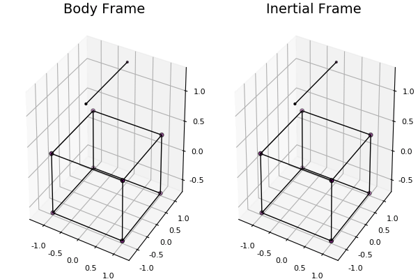

# Deformable body dynamics simulator

## Installation
You can install this package via the following commands inside the Julia REPL:

```julia
import Pkg
Pkg.add("https://github.com/iagoleal/DeformableBodies.jl.git")
```

## Usage

The folder `examples/`
contains some examples of how to construct a model.

The result of a simulation is summarized on the following figure,
made with the example file `examples/cubecopter.jl`:



## Mathematics behind the program
_Geometry goes here._

## TODO
- Write better documentation;
- Find trajectory that optimizes energy from a parametrized family.

## Disclaimer
No real cats were harmed during the development of this program.
