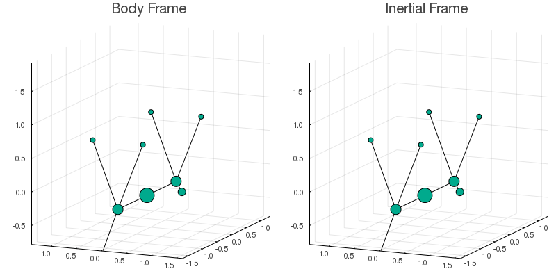

# Deformable Bodies Dynamics

`DeformableBodies.jl` is a Julia package dedicated
to the study and solution of a special class of problems from classical mechanics:
_deformable bodies_.

The data needed for solving a deformable body problem
consists of the body trajectory with respect to an arbitrary reference frame.
Given this, we can reconstruct the body's trajectory from the point of view of an inertial frame
as a sequence of rotations from one frame to the other.
In order to avoid gimbal lock,
all the rotations in this package are represented using unit quaternions.

## Example

The figure below represents the movement
that a falling cat[^disclaimer] does when righting itself midair
both from the perspective of a frame _rotating together with the cat_
and from an inertial frame.



[^disclaimer]: No real cats were harmed during the development of this program.

## Installation
This package can be installed using the Julia Package Manager.
Simply open the REPL, enter `]` and run

```julia
pkg> add DeformableBodies
```

## Science behind the camera
This package is based on a scientific initiation
that I did with [Prof. Alejandro Cabrera](http://www.im.ufrj.br/alejandro/)
while an undergraduate at UFRJ.
Everything in here is based on Alejandro's [paper](https://arxiv.org/abs/math-ph/0611051):

* Cabrera, Alejandro. “A Generalized Montgomery Phase Formula for Rotating Self-Deforming Bodies.” Journal of Geometry and Physics 57.5 (2007): 1405–1420. Crossref. Web.

Furthermore,
this package strongly builds upon the fantastic work done by
[DifferentialEquations.jl](https://docs.juliadiffeq.org/dev/index.html)
and [Plots.jl](https://docs.juliaplots.org/latest/).
Make sure to also check these projects.
